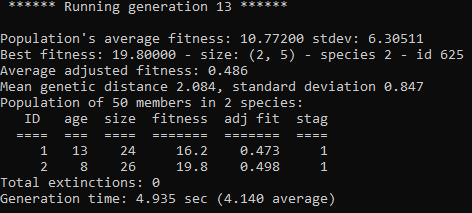

# Flappybird using Artificial intelligence
## Dependencies
* [neat-python](https://neat-python.readthedocs.io/en/latest/)
* [pygame](https://www.pygame.org/news)

## More informations
* [neat article](http://nn.cs.utexas.edu/downloads/papers/stanley.cec02.pdf)
* [neat documentation](https://neat-python.readthedocs.io/en/latest/neat_overview.html)

## In game

## Final report in terminal

